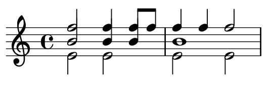

# User Guide

## Brief Overview

The main way to change results produced by `geniartor` package is to use a custom config. Like [the default config](https://github.com/Nikolay-Lysenko/geniartor/blob/master/geniartor/configs/default_config.yml), this new config must have 4 top-level sections:
* `piece` for result properties that are set explicitly;
* `evaluation` for more subtle properties that should be optimized;
* `optimization` for optimization method;
* `rendering` for saving result as WAV and MIDI.

As of now, this guide does not cover meaning of each config parameter, but you can look at the source code, because it has docstrings which do so inplace.

## Glossary

Terminology used in this project comes from music theory, so it is possible to find a definition of any term in numerous publicly available sources.

The only term that, arguably, has project-specific meaning, is _sonority_. Here, sonorities are defined as sets of simultaneously sounding notes where no notes start or end inside a sonority. For example, below scores contain seven sonorities: from 0 to 0.5, from 0.5 to 0.75, from 0.75 to 0.875, from 0.875 to 1.0, from 1.0 to 1.25, from 1.25 to 1.5, and from 1.5 to 2.0 (where 1 is duration of one measure).

